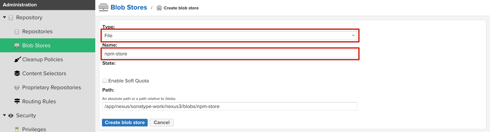
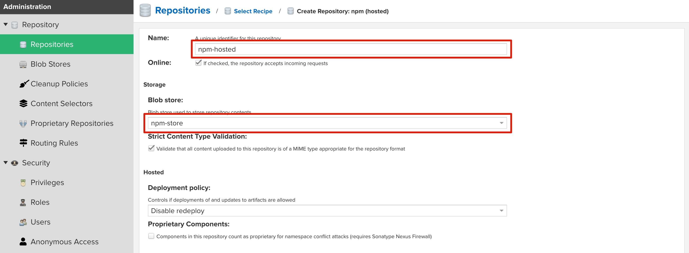
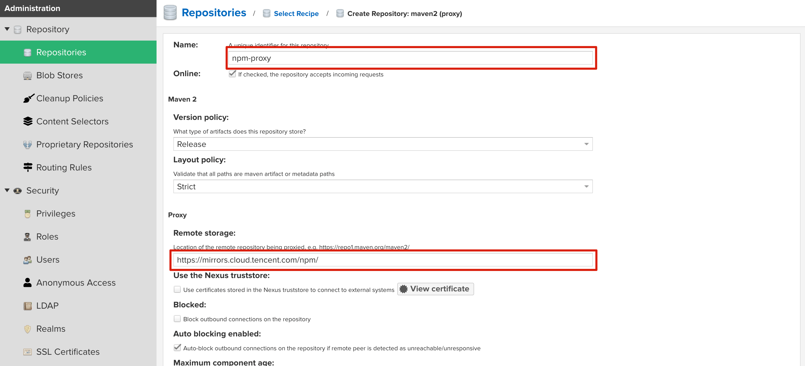
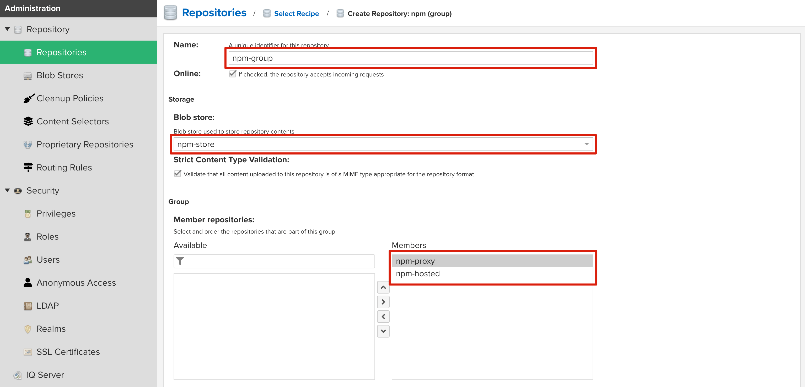
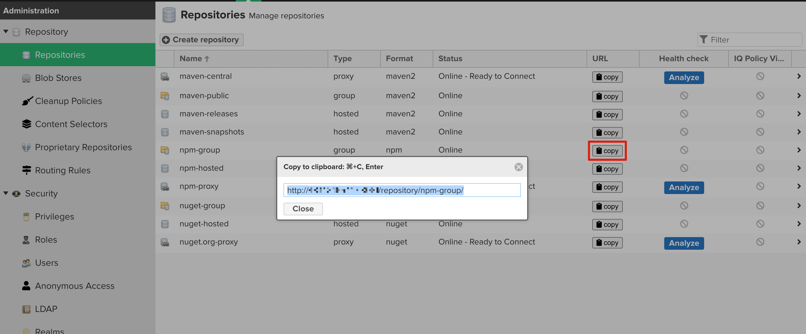

# Nexus
## Nexus下载
[Nexus官网](https://help.sonatype.com/repomanager3/product-information/download) 

[Nexus非官网](https://blog.csdn.net/u010741112/article/details/103886347)

:::tip 
建议下载相同或相近的版本，避免接下来操作不一致
:::
## Nexus解压

```:no-line-numbers
tar -zxvf nexus-3.37.3-02-unix.tar.gz
```

解压后的文件夹包括：

nexus-3.37.3-02 ：程序的安装执行文件

sonatype-work ：数据存储、缓存等文件

## Nexus启动
进入文件夹
```:no-line-numbers
cd nexus-3.37.3-02\bin
```
执行启动命令
```:no-line-numbers
./nexus start 
```
等待一段时间后出现以下内容
```:no-line-numbers
[root@hc bin]# ./nexus start
WARNING: ************************************************************
WARNING: Detected execution as "root" user.  This is NOT recommended!
WARNING: ************************************************************
Starting nexus
```
执行命令查看nexus当前状态
```:no-line-numbers
[root@hc bin]# ./nexus status
WARNING: ************************************************************
WARNING: Detected execution as "root" user.  This is NOT recommended!
WARNING: ************************************************************
nexus is running.
```
当提示如上图状态时，说明启动成功

访问地址：http://服务器地址:8081/

:::tip 
需开放服务器相应端口的访问权限（防火墙等），nexus默认端口为8081
:::

首次登录，需查看Nexus的密码：
```:no-line-numbers
cat sonatype-work/nexus3/admin.password
```
登录用户admin

登陆成功后修改密码

:::tip 
启动失败或无法访问时可以执行./nexus run 进行启动，查看报错原因。
nexus 默认配置的内存大小是需要 2G，有些版本对内存要求可能更高。
:::
进入nexus-3.37.3-02\bin目录，执行：cat nexus.vmoptions查看
```{3-5}
[root@hc bin]# cat nexus.vmoptions

-Xms512m
-Xmx512m
-XX:MaxDirectMemorySize=700m
-XX:+UnlockDiagnosticVMOptions
-XX:+LogVMOutput
-XX:LogFile=../sonatype-work/nexus3/log/jvm.log
-XX:-OmitStackTraceInFastThrow
-Djava.net.preferIPv4Stack=true
-Dkaraf.home=.
-Dkaraf.base=.
```
如服务器内存大小不够，可修改如上高亮配置，降低nexus默认内存配置要求

nexus停止命令
```:no-line-numbers
./nexus stop
```
## Nexus仓库
仓库类型分为3种：

| 仓库类型  | 说明 |
| ------------- | ------------- |
| group  | 组类型，能够组合多个仓库为一个地址提供服  |
| hosted  | 本地存储。像官方仓库一样提供本地私库功能  |
| proxy  | 提供代理其它仓库的类型  |

### npm仓库配置
添加Blob Store，定义仓库类型和名称


添加npm hosted，定义名称和仓库


添加npm proxy，定义名称和代理地址


添加npm group，定义名称和仓库及组合成员


复制仓库路径，修改本地npm代理即可使用
